# predictive-maintenance-sim

by Joe Hahn, 
joe.hahn@oracle.com, 
21 April 2019 
git branch=master

The python codes and Jupyter notebooks provided here are used to
simulate a Predictive Maintenance (PdM) strategy 
applied to a suite of 1000 virtual oil & gas wells. A simple toy-model approach is used here, 
to simulate the production variations that real wells might experience
as they operate over time. Each simulated well has three virtual sensors that measure three mock quantities:
pressure P, temperature T, and load L.
As time advances, a well's P,T,L settings slowly random-walk away
from the well's sweet-spot, which is where well production is highest and faults are rarest.
And as a well random-walks further from the sweet spot, it becomes ever more likely to suffer a failure,
which then zeros the failed well's production as it waits for the next
available technician to service it. And when the technician does complete the repair,
that well's P,T,L settings are then returned to its sweet spot, and production resumes. Note that
this simulation also has a limited pool of virtual technicians, and if technicians become
oversubscribed by failed wells, then
the next failed well must wait until a tech completes the current repair before servicing
the next failed well, and such bottlenecks can result
in a considerable loss of production. Simulated 
wells are also subject to three possible mock faults: a jammed_rotor, cracked_valve, or broken_gear, and every 
tech that diagnoses a failed well also notes that diagnosis in repair log.

The simulation is initially executed in run-to-fail (RTF) mode, which means that wells are
serviced only after experiencing a failure, and the purpose of the RTF simulation is to generate
a large pile of telemetry and repair data. Machine learning (ML) models are then trained on the
telemetry + repair logs, to predict which operating wells are likely to fail soon. After the ML models
are built, the following then reruns this simulation in PdM mode, which uses those ML models to flag those
wells that are likely to fail soon, and then assigns available service technicians to perform
preventative maintenance on the flagged wells. After the PdM simulation is complete,
a Jupyter notebook loads the PdM output to assess how the suite of simulated wells'
production is boosted by the PdM strategy, and how PdM also impacts the technicians'
utilization.

### requirements:

This demo was written in python v2.7 with these additional python packages also installed: 
jupyter, matplotlib, numpy, pandas, scikit-learn, and seaborn.

### execute RTF simulatation:

Before running the simulation in run-to-fail (RTF) mode, inspect the simulation parameters stored in
https://git.oracledatagroup.com/jhahn/pdm_demo/blob/open_source/inputs_rtf.py ,
those parameters specify the number of wells to be simulated (N_devices=1000),
the number of timesteps to take when evolving this system (N_timesteps=50000),
the size of the step that each setting takes each timestep as it random-walks
across the P,T,L parameter space (sensor_sigma=0.01), the time interval
that each sensor must wait before emitting any telemetry (output_interval = 10 timesteps),
the maintenance strategy used by the simulation (strategy='rtf'),
the number of technicians available to service the oil wells (N_technicians=100),
and the time required for a technician to repair a well that suffered a fatal
failure (repair_duration=100 timesteps). Alter any of these parameters to
change the rate at which the simulation evolves, for example increasing or decreasing
sensor_sigma will increase or decrease the rate at which an oilwell's sensors random walk,
while a decrease to N_technicians increases the chance that wells will fail faster than
technicians can repair them, which can cause a dramatic drop in production.

The rate at which the oilwells suffer failures is controlled by the issues dictionary,

    issues = {
        'crud':         {'ID':0, 'coefficient':0.100000,   'fatal':False},
        'jammed_rotor': {'ID':1, 'coefficient':0.000080,   'fatal':True },
        'cracked_valve':{'ID':2, 'coefficient':0.000010,   'fatal':True },
        'broken_gear':  {'ID':3, 'coefficient':0.000002,   'fatal':True },
    }

and any increase in an issue's coefficient also increases the likelihood of an oilwell suffering
that issue. Note also that the crud issue is not a fatal issue; a well that accumulates
crud damage will experience lower production, but crud damage does not halt a well's production. However 
the jammed_rotor, cracked_valve, and broken_gear issues cause a well to accumulate
damage, and damaged wells are more likely to suffer a fatal failure that halts production
until a technician arrives to service that well. 

To evolve those N_devices=1000 wells for N_timesteps=50000 during which
they produce oil/gas while occasionally experiencing downtime due to issues, execute

    python pdm.py inputs_rtf.py
    
which will generate a stream of FAILURE reports as devices (aka wells) fail due to various issues, and are
sent to MAINTENANCE where an available technician is assigned to repair that device:

    DEVICE  FAILURE    :    time =  240 deviceID =  102
    FAILURE MAINTENANCE:    time =  240 deviceID =  102 	issue =  cracked_valve 	technicianID =  72 	repair_complete_time =  340
    REPAIR  COMPLETE   :    time =  242 deviceID =  46 	    technicianID =  29

with the above indicating that the well whose deviceID=102 suffered a fatal issue at
timestep=240. A maintenance technician whose technicianID=72 was then assigned to well #102,
who diagnosed that well as suffering from a cracked_valve, with that issue to be repaired
by time=340. Note that, two timesteps later, 
technicianID=29 completes his repair of deviceID=46, and that well then resumes production
and that technician then becomes available to repair any other failed well.

Execution of this RTF simulation takes about 15 minutes to complete, and two compressed
output files are written, the telemetry emitted by the wells' sensors, as well as a log
of all repairs performed by the service technicians. To inspect the telemetry data,

    gunzip -c data/telemetry_rtf.csv.gz | head -20

which yields something like

    time|deviceID|sensor|value
    0|-1|N_technicians|0.0
    0|-1|N_operating|1000.0
    0|-1|N_failed|0.0
    0|-1|N_repair|0.0
    0|-1|N_maintenance|0.0
    1|1|temperature|-0.024763457673726588
    1|1|production_rate|0.9971612468261769
    1|9|temperature|-0.013862134855135395
    1|9|production_rate|0.9985759425457806
    1|11|temperature|-0.0373034887513702

The telemetry ouput is a 25 million record long file composed of timestamped key-value pairs,
and the above tells us that at time=1, the well whose deviceID=1 had temperature
T=-0.024763457673726588 at that moment, keeping in mind that all mock temperatures, pressures,
and loads are measured relative to a well's sweet spot where (T,P,L)=(0,0,0).
The RTF simulation also emits summary statistics as well, with the above telling
us that, just before the simulation started at time=-1, there were zero
technicians servicing the wells (ie N_technicians=0), all wells were
operating (N_operating=1000), zero wells had failed, zero were being repaired,
and that zero wells were flagged for maintenance.

The other file generated by the RTF simulation is the repair log:

    gunzip -c data/repairs_rtf.csv.gz | head

which yields something like

    time|deviceID|issue|technicianID|temperature|pressure|load|production_rate
    141|46|jammed_rotor|29|-0.023390762068105003|-0.22793915479892896|-0.07420741484217944|0.9759147085427359
    149|941|jammed_rotor|77|0.07319479632982435|0.17941953011321646|-0.08408734956291827|0.9788766649526339
    161|882|broken_gear|33|-0.42706000097384045|0.02374669927933839|0.2712394402300609|0.949352691671249

which tells us that at time=141, deviceID=46 failed, and that technicianID=29 had diagnosed that
failure as being due to a jammed_rotor, with the remaining fields recording that well's
P,T,L settings at the moment of failure, as well as the well's production_rate then.

To inspect the RTF output in greater detail, start jupyter via

    jupyter notebook --ip=127.0.0.1

browse the indicated url, and
then navigate to _inspect_rtf_sim.ipynb_ and click the >> button to refresh that notebook's content.
That notebook will load the simulation's telemetry into a pandas dataframe, as well as the repair logs,
then join those two datasets as the records dataframe, with that dataframe then used to generate a number of plots.
Such as this pseudo 3D plot of the trajectories of three wells' (T,P,L) settings that
evolve over time as they random-walking away from  their sweet spot where (T,P,L)=(0,0,0). 
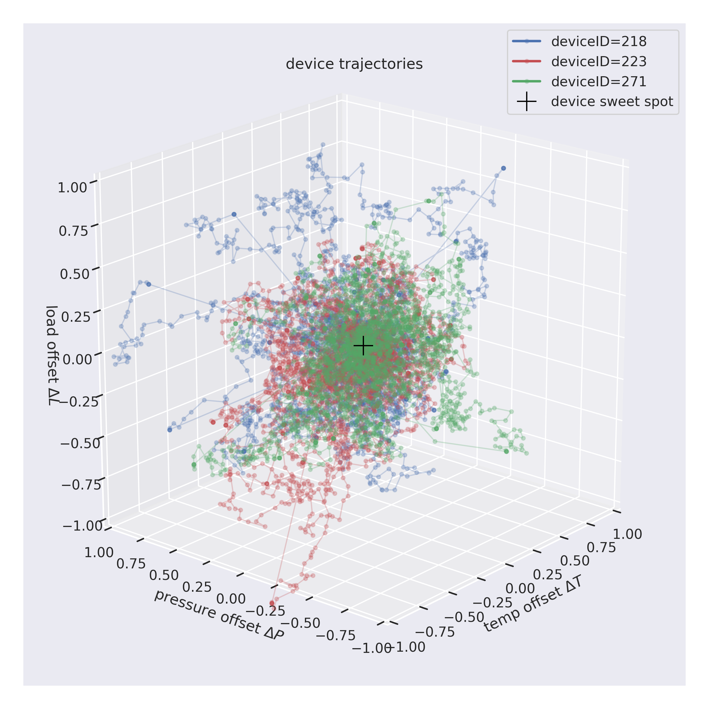 

A well's production also degrades over time due to the accumulation of crud, with production also being interrupted
as fatal issues occur and are repaired, which is illustrated by this plot of
well #123's production efficiency over time:
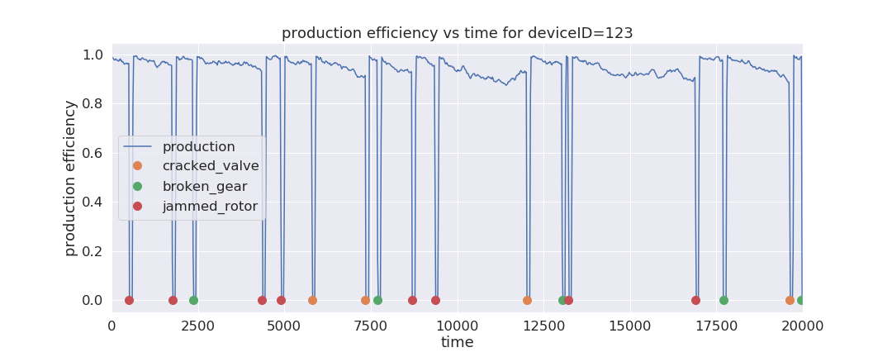 
which evidently suffers occasional downtime when this well experiences a fatal issue that zeros its
production until a virtual repair technician becomes available to diagnose and then repair the issue
during the subsequent repair_duration=100 timesteps. There are of course many other wells also producing,
failing, being repaired etc, and the following shows that those 1000 wells
have an average production efficiency of about 87.5% (red curve) when wells are run in RTF mode:
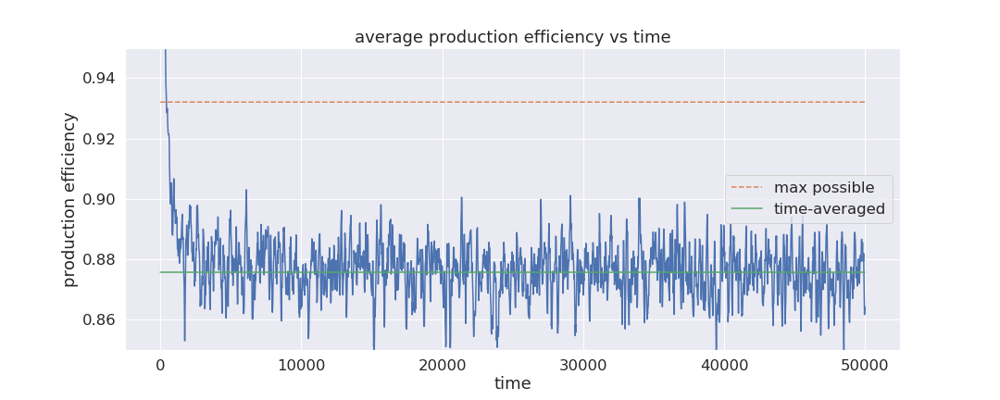 

The next plot shows the technicians' utilization versus time, this is the fraction of all 
technicians assigned to repair failed wells at any moment during the RTF simulation
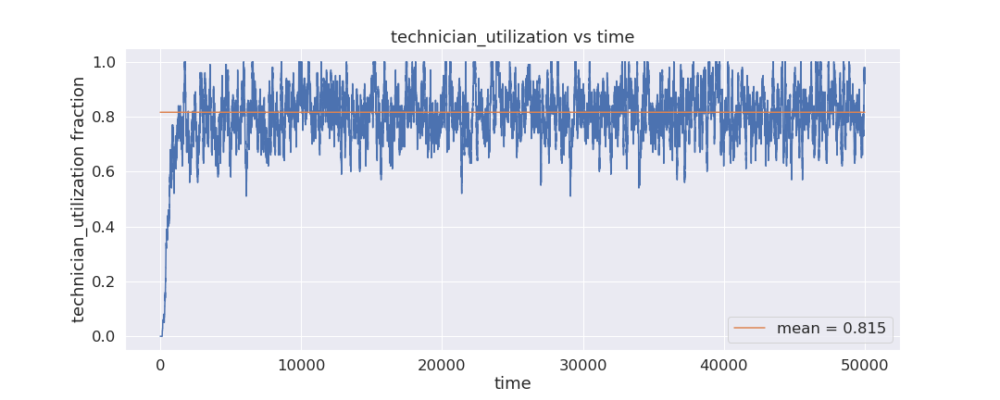 
and note that the technicians' average utilization is 81.6% during RTF.

See the  _inspect_rtf_sim.ipynb_ notebook for other useful diagnostic plots, such as 
this plot of the wells' distribution of times until next fail,
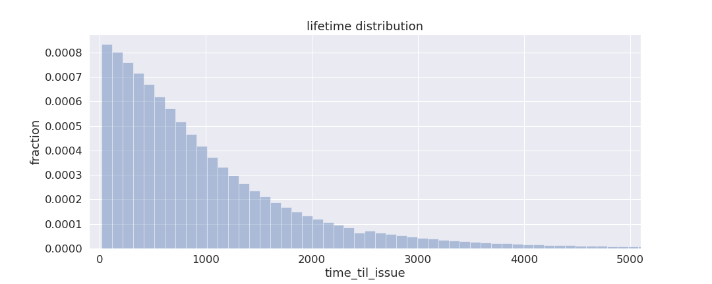 

The various issues are by design more or less probable in various portions
of the (T,P,L) parameter space, and the following scatterplot shows that the
jammed_rotor issue is most likely to occur when a well's temperature
T gets large:
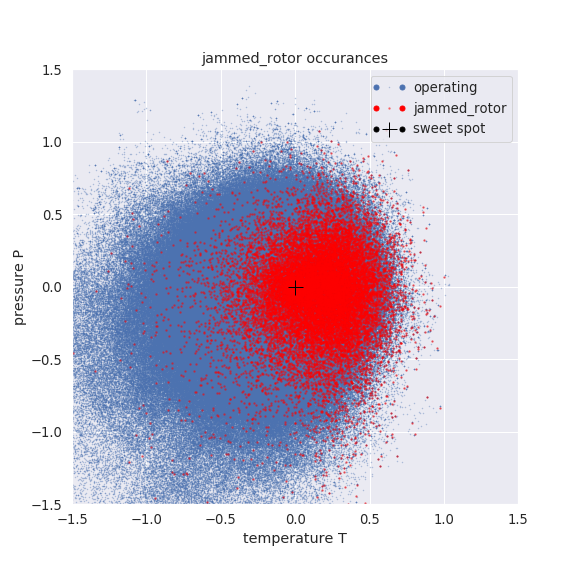 
The heat map below is the ratio of density of red (failed wells) dots to blue (operating wells) dots
as a function of their (T,P) settings, and that ratio
is also the probability per time that a well suffers a jammed_rotor: 
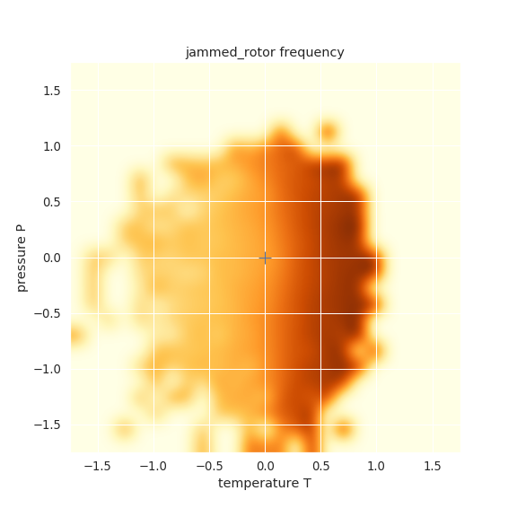 
See the _inspect_rtf_sim.ipynb_ notebook for heatmaps of the other issue probabilities;
those heatmaps show that the likelihood of a cracked_valve grows when P gets large,
and that the broken_gear issue gets more likely when either the load L or the
quantity (|P| + |T|) gets large. 
The subroutine that encodes these issue-probabilities as functions of a well's (T,P,L) is 
https://git.oracledatagroup.com/jhahn/pdm_demo/blob/open_source/helper_fns.py#L40 ,
which can also be modified further if one wishes to introduce additional well issues.

### assess potential benefits of PdM:

Now use results from the run-to-fail (RTF) simulation to anticipate the maximum possible production
boost that these wells might experience when RTF maintenance is replaced by a predictive maintenance
(PdM) strategy; that efficiency is simply the operating wells' mean production rate (which was lessened slightly
by the mock crud that wells accumulate while operating) which in the RTF simulation is 95.2%,
minus the small production loss that occurs as the PdM strategy schedules maintenance for
those wells that are in imminent danger of failing. The RTF simulation assumed that the downtime
for an unplanned failure was repair_duration=100 timesteps, and lets suppose for sake of argument
that the downtime that results from a more orderly PdM-style predictive maintenance intervention is 
maintenance_duration=repair_duration/4. One can then show that the production loss due to the PdM-managed maintenance
strategy is only about 2% assuming the ML models used by PdM are 100% accurate
(this quantity is calculated in paragraph 14 of _inspect_rtf_sim.ipynb_), so the maximum possible
production efficiency will be 93.2% (see green dashed line in above plot of production
eficiency), which means that PdM can only boost these wells' average production
efficiency by at most 6%. Also keep in mind that no ML model is 100% accurate. And since this is our first
stab at developing models for a PdM strategy, it seems reasonable to expect that our first generation ML models
will be able to correctly identify about 50% of those wells that are in imminent danger of failing, 
which leaves another 50% of failing wells to fail catastrophically with repair times that are 4X longer
than that due to predictive maintenance, and the net effect of such model
errors is to reduce the productivity gains of PdM from 6% down to about 2%. The purpose of this discussion
is to set realistic expectations on the production boost that might be achieved when PdM is applied
to upstream oil & gas, with that boost likely to be modest indeed. But do keep in mind that a 2% production
boost by a firm producing a million barrels of oil/day worth $50/barrel will still see its revenue boosted
by roughly a million dollars/day, so PdM for upstream oil & gas is clearly worth while.

### build ML models for PdM:

Three ML models are to be built, one for each fatal issue, and the purpose of these models is to answer
a simple question: will a given well experience a particular fatal issue some number
of timesteps hence? Which is a binary classification problem, and this demo trains a Random Forest
classifier on the historical RTF data to predict whether a well will experience the failure
within _pdm_threshold_time_ timesteps hence, where pdm_threshold_time is an adjustable parameter
that is set in the inputs_pdm.py file, 
and some trial-and-error experimentation shows that setting pdm_threshold_time=400 works well.
To build those three binary classifier models, load and then execute the _build_models.ipynb_ notebook;
that notebook executes in about 20 minutes as it loads the historical telemetry and repair data, 
joins the two datasets, and then computes at every timestep the time until each well next suffers
each of the 3 possible failures: cracked_valve, broken_gear, or jammed_rotor.
Then, for every well at every moment in time, the notebook
uses a binary flag to indicate those wells that do indeed
fail within pdm_threshold_time=400 timesteps hence, which is the ML models' target variable.
The notebook then trains three Random Forest
models on 67% of the well's historical sensor data, as well as each well's time-since-last-issue,
to predict whether a well will experience each of the three issues
during the subsequent 400 timesteps. That notebook then assesses the models' accuracies
by comparing model predictions to actual outcomes that occurred in
the 33% sample that was set aside for testing, and then saves those trained models to disk for reuse later. 
The scored testing sample data is also stored as compressed csv and can be inspected via

    gunzip -c data/xy_test.csv.gz | head -10

Each model outputs two quantities, a True or False to indicate whether the model predicts
that a given well will experience the corresponding fatal issue during the next 400 timesteps,
as well as a confidence score that scales with the model's internally-assessed
accuracy; that confidence score ranges from 0.5 (ie the model prediction is an educated guess) to 1.0 (the
model is extremely confident that its prediction is correct). And to quantify model accuracy,
the following shows the models' False positive rate versus the models' confidence scores: 
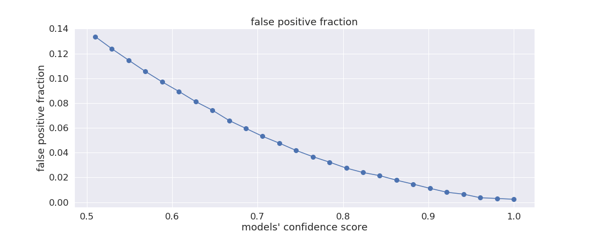 
and the above tells us that when a prediction's confidence score exceeds 0.5,
then the model will incorrectly flag a healthy well as being in danger of failing
14% of the time, but note that that error rate drops to less than 0.2% when 
the model confidence is near 1.0 . These False positives negatively
impact the wells' average production efficiency, since a False positive sends a well into maintenance
prematurely, which also increases the load on the limited pool of virtual technicians.

The other possible erroneous model prediction is a False negative, and the
models' False negative rate versus model confidence score is
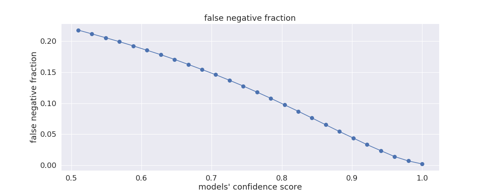 
False negatives also reduces the benefit of PdM, since in that case
the model does not detect a well's imminent failure, and if that persists throughout subsequent timesteps
then the well will suffer a catastrophic failure, which also 
diminishes overall production efficiency due to the longer repair times.

### execute PdM simulation:

Now that the PdM models have been built, execute the simulation again but in PdM mode:

    python pdm.py inputs_pdm.py

which calls the same pdm.py script that instead reads the inputs_pdm.py parameter file,
which has settings that are identical to that used earlier (eg inputs_rtf.py)
except that strategy='pdm' and that the wells are only evolved for N_timesteps=20000.
In this run the ML models are loaded and then used every pdm_skip_time=5 timesteps to flag any wells
that are predicted to fail during the subsequent pdm_threshold_time=400
timesteps, and those wells are then sent to preventative maintenance provided when there
are technicians available for servicing. 
This PdM simulation sets maintenance_duration=repair_duration/4, so
these flagged wells only spend one-quarter the time undergoing repairs as any well
that still manages to suffer a fatal failure, and this setting is intended to mimic
the expected benefit of an orderly shutdown and repair, whereas wells that do
suffer a uncontrolled fatal fail are assumed to experience greater damage
that requires spending 4x longer being unproductive while being repaired.

The PdM simulation takes about 15 minutes to complete, and the simulated wells'
sensor telemetry is stored in data/telemetry_pdm.csv.gz while the technicians'
repair log is stored in data/repairs_pdm.csv.gz . Inspection of the PdM simulation's
screen output shows additional lines like

    prevent MAINTENANCE:    time =  435 deviceID =  443 	issue =  jammed_rotor 	technicianID =  32 	repair_complete_time =  460 	****

which tells us that at time=435 the jammed_rotor classifier predicted that well #443 would
soon suffer that fatal issue, with technicianID=32 being tagged to perform preventative
maintenance on that well which would be complete by time=460.

To inspect the PDM simulation output, load the _inspect_pdm.ipynb_ Jupyter notebook
and press >> to refresh, which generates this plot of the well's production efficiency versus time (blue curve)
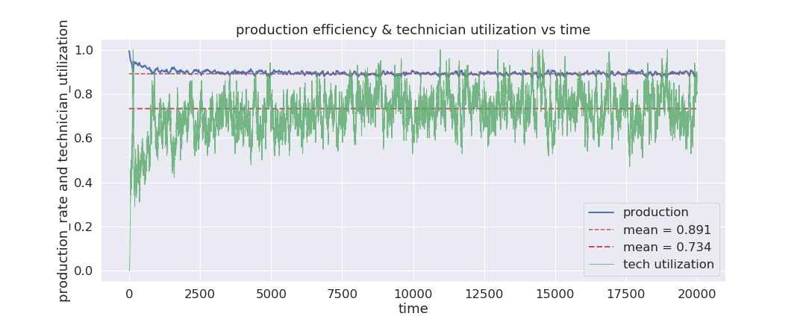 
as well as the technicians' utilization fraction (purple curve). The wells' mean production efficiency
is 89.1% when operated using the PdM strategy, which as expected is only a 2% production boost over
wells operating in RTF mode. Interestingly, these technicians' mean utilization is 73.4% (red line)
when PdM is used, and this is almost 10% lower than during RTF,
which suggests that the greatest benefit of PdM for upstream oil & gas is a
significant reduction of the workload that the repair technicians experience.

The green curve in the following plot shows the fraction of wells that are idle at
any moment because the PdM algorithm sent them into preventative maintenance, about 2% of all wells,
while the blue curve shows that an additional 2.5x more wells are idled by fatal failures
that the PdM models did not anticipate:
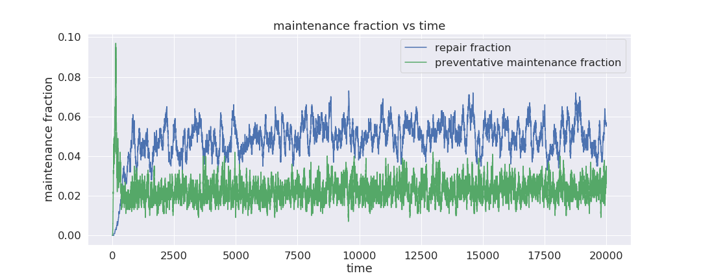 
If model accuracies can be improved further, that would inch the blue curve down towards the green curve,
would boost the wells mean production efficiency slightly, and would lessen the technicians workload noticeably.
An obvious way to improve model accuracy is to train the ML models on lagged sensor data, such as time-averages
of each well's (P,T,L) settings going back say, 10 100 and 1000 timesteps, and that modification
is on this demo's roadmap, see _next steps_ below.

### sensitivity to simulation parameters:

This simulation of PdM has many adjustable paramers, and three such parameters 
have a significant impact on the success of PdM: pdm_threshold_probability, pdm_threshold_times,
and the ratio maintenance_duration/repair_duration. The following summarizes the 
consequences when these parameters are varied.

The parameter pdm_threshold_probability was set to 0.5 in the above simulation,
and this sets the minimum confidence score that is required of the ML models
before the PdM algorithm assigns a well to predictive maintenance. Setting this parameter
to higher values and rerunning the pdm.py script causes fewer wells to be sent to predictive
maintenance because the pdm.py script requires the ML models to be more confident in their predictions. To see this, 
use Jupyter to navigate to the _simulations/pdm_threshold_probability/production_technician.ipynb_
notebook, which shows results for a suite of PdM simulations having 0.5 ≤ pdm_threshold_probability ≤ 1.0,
and that notebook shows that lower values of pdm_threshold_probability always yield
higher well production and lower technician utilization.

PdM sensitivity to the pdm_threshold_time parameter is explored in the 
_simulations/pdm_threshold_time/production.ipynb_ notebook, noting that this parameter
is the number of timesteps-hence
that the ML classifiers are trained to predict whether or not a well suffers a fatal
issue. A suite of PdM simulations was
performed, with models predicting whether failures occur 
100 ≤ pdm_threshold_time ≤ 800 timesteps-hence, 
and the notebook shows that PdM was most performant when pdm_threshold_time=400.

The _simulations/maintenance_duration/production.ipynb_ notebook assesses PdM outcomes as a function
of the maintenance_duration/repair_duration ratio; that quantity is the ratio of the time required of
a technician to service a well that PdM had flagged for predictive maintenance, divided by the longer
time that a technician needs to service a well that had instead suffered a fatal issue.
Several simulations having 0.02 ≤ maintenance_duration/repair_duration ≤ 1.0 were performed,
 
and the above shows that a PdM strategy only boosts production above that that seen in RTF simulation
when maintenance_duration/repair_duration ≲ 0.5. Note also that the resulting production boost
is a very weak function of maintenance_duration/repair_duration, for even when 
the predictive maintenance_duration is very short--only 2% of the fatal repair_duration--the
wells' mean production efficiency is boosted only 3.5%.  However these simulations also show
that the technician's workload can be significantly lessened when maintenance_duration/repair_duration gets small,
with technician utilization as low as 54% when maintenance_duration = 2% of repair_duration:
 

### summary of findings:

* A toy-model simulation is developed and used to assess the impact of a predictive maintenance (PdM) strategy
that is applied to upstream oil & gas. The model's key features include code that generates mock sensor
telemetry plus repair logs emitted over time by numerous virtual oil & gas wells that produce fluid and also
suffer occasional failures, as well as the productivity loss that results  
as failed wells wait to be repaired by a pool of virtual repair technicians.
The simulated wells are first evolved using a run-to-fail (RTF) maintenance strategy.
Machine learning (ML) models are then trained
on that RTF telemetry + repair data to predict whether a given well will suffer a particular fatal issue
X number of timesteps hence. Then the simulated wells are evolved
again in PdM mode, which uses those ML models to preferentially
repair those wells most likely to fail soon. Jupyter notebooks are also used to inspect simulation output
and to quantify the production boost that results from PdM

* When a PdM strategy is applied to this toy-model simulation of
upstream oil & gas, only very modest gains in well productivity were achieved, about 1-3%

* Additional modest boosts in well productivity can likely be achieved with additional improvements
in the accuracy of the ML models

* These toy-model simulations also show that a PdM strategy can significantly reduce the workload
experienced by the pool of virtual technicians that maintain and service these wells, with workload
reductions at the 10-30% level

### next steps:

1 boost model accuracy by including lagged sensor readings

2 tailor pdm_threshold_time so that different values can be used by the 3 different models

### notes:

1 if notebooks or pdm.py hit out-of-memory errors, shut down all other notebooks
